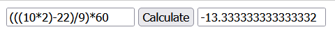

# no-eval-calculator-typescript
Calculating arithmetical expressions like (((10*2)-22)/9)*60 without using eval function via pure Typescript.

Test calculation:

Only +,-,*,/ operations supported.

If you are not familiar with Typescript, please have a look at that learning module: https://docs.microsoft.com/en-us/learn/modules/typescript-get-started/

After fetching the repository, open textCalculator.html file via any web browser.